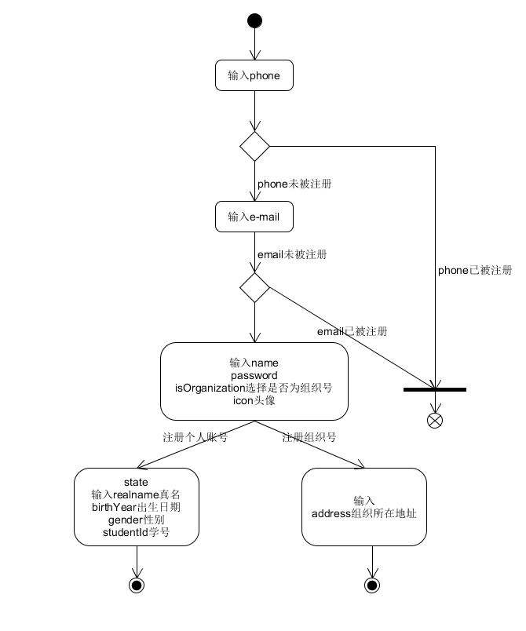
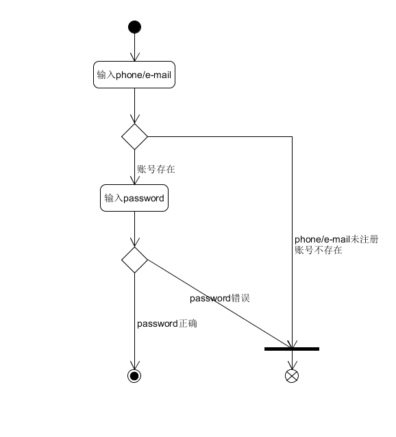
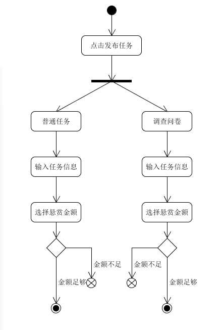
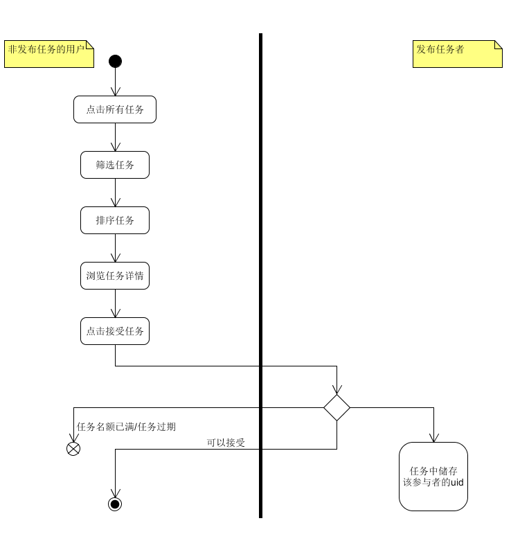
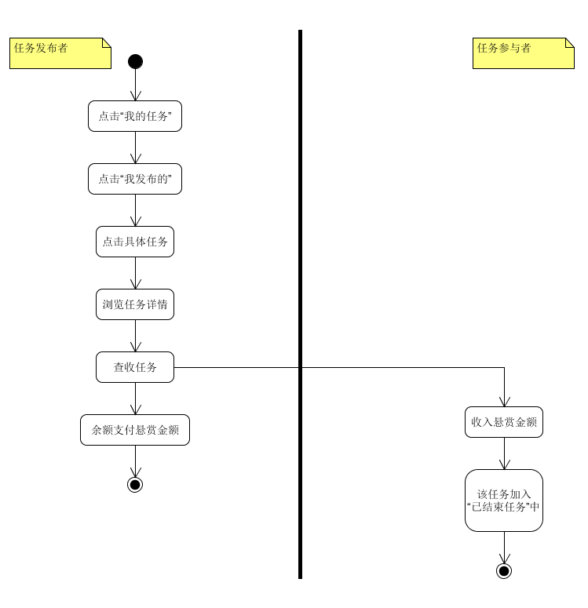

# 用例规约
{:.no_toc}

* 目录
{:toc}

## 用户注册

### 简要说明  

  - 相关需求：新用户需要注册一个账号，可以注册**个人账号**或者**组织账号**
  - 参与者：用户
  - 前置信息：用户点击注册按钮，进入注册页面
  - 后置信息：用户注册信息存入数据库，回到登录面输入账号密码进行登录

### 事件流

  - 主成功场景事件流：
    - 输入未被注册的手机号phone和电子邮箱号e-mail
    - 输入昵称，密码，头像，选择是注册为个人账号还是组织账号
    - 个人账号：
      - 输入真名，出生日期，性别及学号
      - 完成注册，回到登陆界面
    - 组织注册：
      - 输入组织所在地址address
      - 完成注册，回到登陆界面
  - 拓展事件流：
    - phone或者emai已经被注册了
    - 提示错误

  

## 用户登录  

### 简要说明  

  - 相关需求：用户使用**个人账号**或者**组织账号**通过输入账号（phone/e-mail）密码进行登录
  - 参与者：用户
  - 前置信息：用户已经注册过账号
  - 后置信息：登录验证成功之后，用户进入主页面

### 事件流  

  - 主成功场景事件流：
    - 未登录情况下用户进入登录界面
    - 输入phone或者e-mail
    - 输入密码
    - 验证成功则进入主页面
  - 拓展事件流：
    - phone或者e-mail尚未注册
    - 密码错误
    - 登陆失败

  

## 发布任务  

### 简要说明  

  - 相关需求：用户使用**个人账号**或者**组织账号**发布任务，可以发布一般任务或者调查问卷
  - 参与者：用户
  - 前置信息：用户登录成功
  - 后置信息：任务写入数据库，并且在任务界面添加该项新任务

### 事件流  

  - 主成功场景事件流：
    - 已登录的用户点击发布任务按钮，进入填写任务信息界面
    - 用户填写任务的基本信息(包括标题，任务类型：普通任务or问卷，截止日期，悬赏金额，参与人数，任务描述)
    - 填写完毕，用户点击发布任务
    - 任务发布完成
  - 拓展事件流：
    - 发布任务填写的金额大于该账户的剩余金额
    - 任务发布失败

  

## 浏览任务并接受任务

### 简要说明  

  - 相关需求：用户可以在主页浏览任务，并筛选以及排序各个任务
  - 参与者：用户，发布任务的用户
  - 前置信息：任务列表中已经有任务被发布过
  - 后置信息：任务被添加到用户的已选任务中，参与者的uid被储存到该任务中

### 事件流  

  - 主成功场景事件流：

    - 非发布任务的用户：	
      - 用户点击”所有任务“按钮，开始浏览所有任务
      - 用户可以筛选任务，筛选条件有“个人发布”，“组织发布”，“可参加的任务”三个
      - 用户可以对任务进行排序，可以根据“悬赏金额”排序，也可以根据发布时间排序
      - 用户可以浏览任务详情
      - 用户点击get按钮，接受任务
      - 任务接受完成
    - 发布任务者：
      - 发布的该任务要储存该参与者的uid

  - 拓展事件流：

    - 任务名额已经满了，接受任务失败

    - 任务过期了，接受任务失败

    

## 查看我的任务  

### 简要说明  

  - 相关需求：已登录的用户可以查看自己发布的任务，自己参与的任务以及已经结束的任务
  - 参与者：用户
  - 前置信息：用户登录

### 事件流

  - 主成功场景事件流：
    - 用户点击“我的任务”按钮
    - 用户查看自己发布的任务，可以查看自己任务的相关信息
    - 用户查看自己参与的任务，可以提交完成任务
    - 用户查看已经结束的任务

## 确认并查收任务  

### 简要说明  

  - 相关需求：任务发布者可以查收自己的任务完成情况
  - 参与者：任务发布者，任务参与者
  - 前置信息：发布的任务有人参与，并且参与者提交了该任务
  - 后置信息：发布者给出的悬赏金额由发布者账户转移到参与者账户（如果有多个参与者，则平均分金额）；该任务加入各个参与者的”已结束“任务中

### 事件流

  - 主成功场景事件流：

    - 发布者点击”我的任务“并进入”我发布的“任务中
    - 点击任务，可以查看任务的具体信息以及完成情况
    - 发布者点击确认查收任务
    - 任务加入参与者的”已结束任务“中，悬赏金额平分到参与者账户中

  
