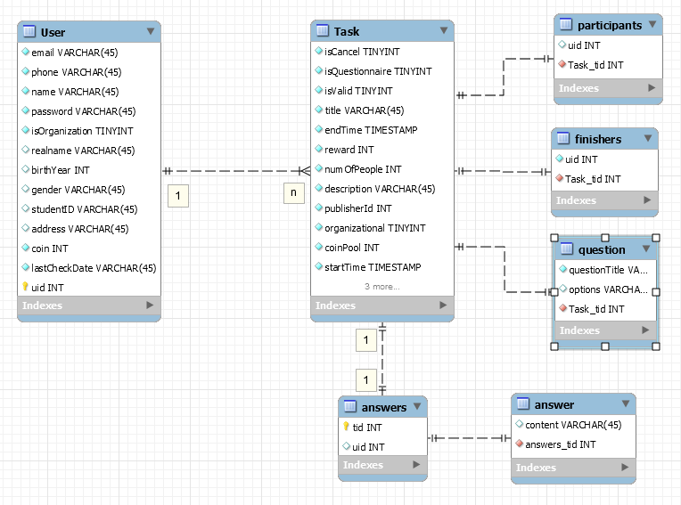

# 数据库设计
{:.no_toc}

* 目录
{:toc}

## 数据库ER图

- 

- 本项目使用MongoDB实现数据库，而MongoDB的特性之一为尽可能的去除关系，因此实际实现时，仅有3个表：User，Task和Answers。另外的几个作为对应数据的一个数组。

## User表

- User使用isOrganization来区分个人账号和组织账号，两种账号会有些数据不同

- **个人账号**
  - realname
  - birthYear
  - gender  (enum["male", "female", "other"])
  - studentID

- **组织账号**
  - address

## Task表

- 每个Task会记录发布人的ID，以及其它相关信息（如时间、任务描述等）；

- Task使用isQuestionnaire来区分普通任务和问卷调查，如果为问卷调查，则用question数组来存储问卷的问题内容。若为普通任务，则没有这个数组；

- 如果Question为选择题，则还会有options数组，存储选项内容；

- Task使用participants数组和finishers数组，来分别记录参与者uid和完成任务者uid。

## Answer表

- 每个Answer有一个tid，来表示其是属于哪个任务（问卷）的填写结果；

- 每个Answer有一个uid，为填写人的id；

- Answer的结构对应其问题Question。
