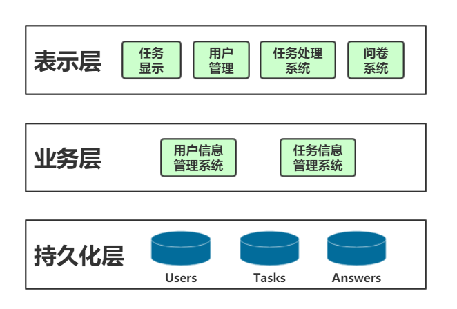

# 架构设计
{:.no_toc}

* 目录
{:toc}

## 逻辑架构

- 

### 表示层

- 用户（任务发布者和接受者）使用Web端作为表示层，提供任务列表的显示与筛选、任务管理系统、任务处理系统、用户管理系统、问卷填写系统。

### 业务层

- 后端服务器充当业务层，根据表示层的请求，完成各个子系统的不同服务模块，向整个系统项目提供不同的功能。

### 持久化层

- MongoDB数据库提供了数据的持久化服务。

## 框架目录

## ECB
