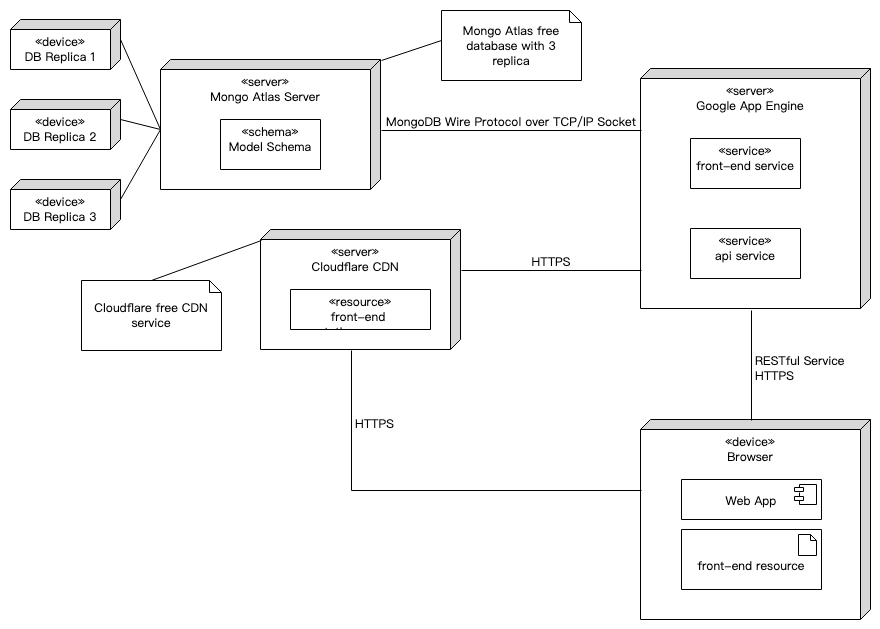

# 部署说明

{:.no_toc}

- 目录
  {:toc}

## 部署架构图

## 部署流程

1. 本地开发结束同步至 GitHub 开发分支
2. 通过 Pull Request 合并开发分支至主分支
3. Travis CI 检测到主分支变更后进行代码检查以及测试
4. 测试通过后通过 gcloud cli 工具部署至 Google App Engine
5. Google App Engine 运行相应程序，程序上线

## 说明

### Google App Engine

GAE 是 Google Cloud 中的一项服务，其提供了 PaaS 服务。我们使用了在香港节点的弹性 NodeJS 环境来运行后端代码。弹性环境可以在访问量增大时自动部署新实例来处理增加的请求。
用到的配置文件包括

- app.yaml (front-end)
- [app.yaml (api-server)](https://github.com/swsad-team/FrontEnd/blob/master/app.yaml)
- [dispatch.yaml](https://github.com/swsad-team/BackEnd/blob/master/dispatch.yaml)

其中`app.yaml` 为服务的配置文件，包含环境以及部分路由配置，`dispatch.yaml` 为 GAE 的路由文件。在本项目中我们将 “/api” 的请求转发给 api-server 服务，其余由 front-end 返回对应静态文件。

由于 api-server 运行时需要 JWT 私钥以及 MongoDB 的 URL，我们需要将在 `app.yaml` 中配置对应环境变量。由于本项目仓库为公开仓库，这些敏感信息不便明文写出。故我们将对应数据储存在 Travis CI 账户中，在 Travis CI 处理时由 [shell 脚本](https://github.com/swsad-team/BackEnd/blob/master/create_app_yaml.sh)生成 `app.yaml`，由此隐藏相关信息。

### Travis CI

Travis CI 提供了 CI 服务，可以进行自动化测试、部署等操作。本项目中使用 Travis CI 来进行代码风格检查以及代码测试，并在主分支变化时自动部署至 GAE 服务中，由此达成初次配置完成后无需人工干预的自动化部署。

Travis CI 用到的配置文件为 [.travis.yaml (api-server)](https://github.com/swsad-team/BackEnd/blob/master/.travis.yml) 以及 [.travis.yaml (front-end)](https://github.com/swsad-team/FrontEnd/blob/master/.travis.yml)。其定义了 CI 时需要执行的命令，以及连接 GAE 时所需要的身份证明文件。其中身份证明文件 `key.json` 时由 Google Cloud 签发的文件，由于该文件不能明文储存在代码仓库中，故储存公钥加密后的文件 `key.json.enc`，在 Travis CI 部署前通过私钥解密文件并以此使用 Google Cloud 命令行工具进行部署。

### MongoDB Atlas

MongoDB Atlas 时 MongoDB 提供的云数据库，其为免费用户提供了 M0 等级的数据库服务。免费服务具有如 QPS、备份、Collection 数量等限制，不过在评估后我们认为目前其可以胜任本应用等数据库服务，若是在日后数据量以及业务增加后需要使用更高等级的数据库也可以直接升级配置，不需要进行数据库迁移等操作。我们使用的是含有 3 个副本，部署在 Azure 香港节点的 M0 级数据库。在连接时我们使用封装后的 mongoose 模块通过 mongoDB wire Protocols 进行数据库操作。

我们通过使用不同数据库来进行调试、测试、正式部署等操作。通过使用云数据库我们避免了开发成员在本地部署数据库的问题，也统一了开发环境以及生产环境。

### Cloudflare

考虑到静态资源部署问题，我们使用了 Cloudflare 提供的免费 CDN 服务来加速用户获取前端静态文件。

## 其他问题

在具体部署过程我们发现 Google App Engine 提供的域名 [project id].appspot.com (swsad-cloud.appspot.com) 由于 GFW 的问题无法在大陆地区访问。故我们通过申请阿里云的域名服务注册了域名 swsad.xyz，通过配置域名解析，实现了通过 swsad.xyz 来访问我们的服务。同时 GAE 也提供了免费的 SSL 证书，故这部分无需单独处理。

## 总结

本次项目部署我们并未使用到任何裸服务器。我们认为通过使用如云数据库以及云应用引擎等基于云的服务可以显著降低部署以及运维成本，也方便后期进行扩容。关于在本项目中并未使用到 Docker，是因为项目服务较少，使用 GAE 部署相对于使用 Docker 部署来说减少了 Docker 镜像打包管理以及 Docker 引擎安装部署等步骤。同时配置了 CI 以及 CD 也使得小组成员能够更加专注于项目设计以及开发本身，避免重复工作，提高了整体的开发效率。
