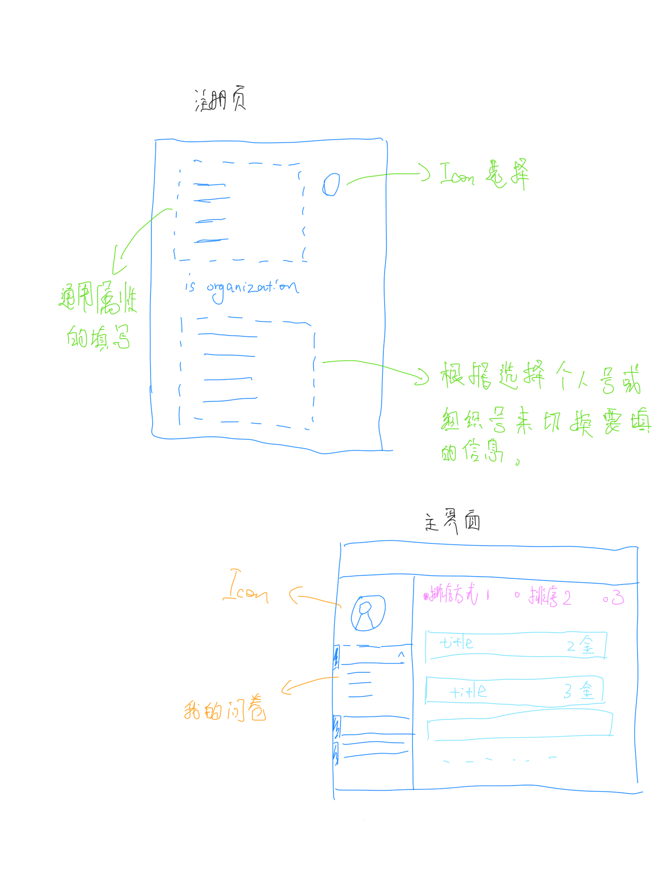

# Meeting1.5
{:.no_toc}

* 目录
{:toc}

## 1、会议概要

- **目标：** 项目代码开发正式启动

- **时间：** 2019.05.21

- 线上会议

## 2、会议内容

- 提醒前端人员开始开发界面，先完成登录注册页与主页面，完善其交互逻辑

- 先暂时将“普通任务”需求砍掉，优先实现调查问卷业务

- 尽快建立API文档，使用Swagger，RESTful规范

- 供前端同学参考的UI：

  - 
