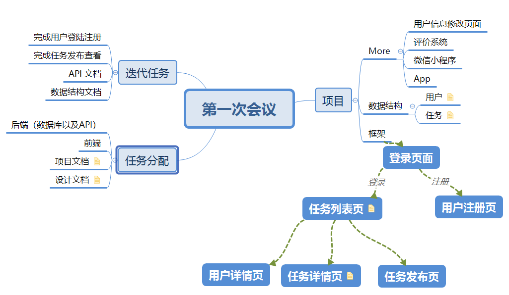

# Meeting1
{:.no_toc}

* 目录
{:toc}

## 1、会议概要

- **目标：** 确定项目的总体框架以及人员分工

- **时间：** 2019.03.20

- 线下会议

## 2、会议内容

- 确定小组人员分工：
  - 组长、项目经理：谭发豪
  - 技术文档与建模：谭江华
  - 市场调研与竞品分析：熊思佳
  - 后端人员：陈佑洋、谭发豪
  - 前端人员：王睿泽、邓子杰、邓茅坤

- 技术确定：
  - 后端使用Express，数据库MongoDB
  - 前端使用React+antd

- 可考虑的扩展内容：
  - App端
  - 微信小程序

- 第一次迭代期间的工作：
  - 业务调研相关的去找找有什么功能相似的竞品，对其进行分析，将其亮点功能提取出来供小组参考；
  - 技术人员先学习各自要用到的具体技术；
  - 先建立简单的项目代码框架（前端后端分离开发）。

## 3、思维导图

