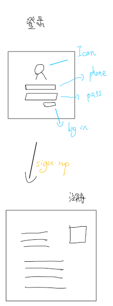
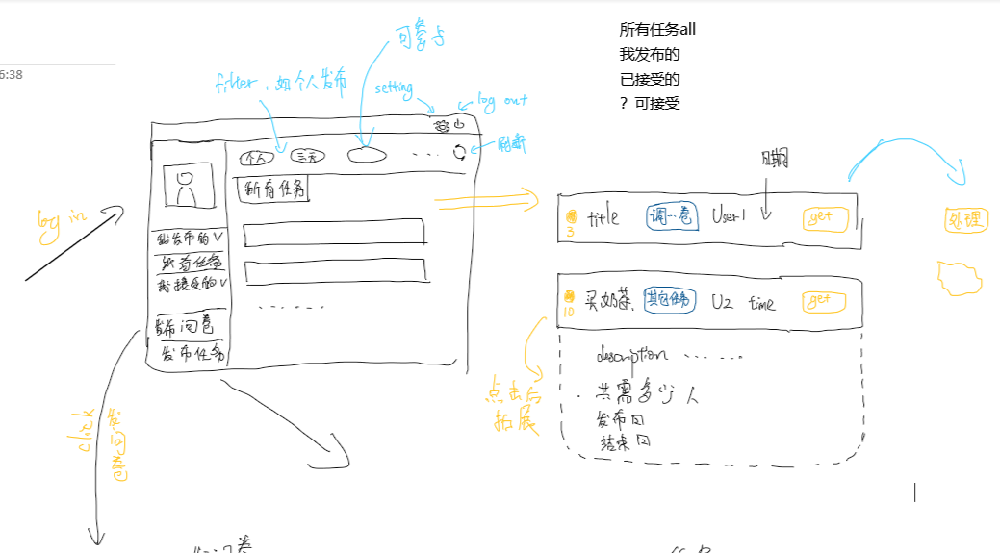
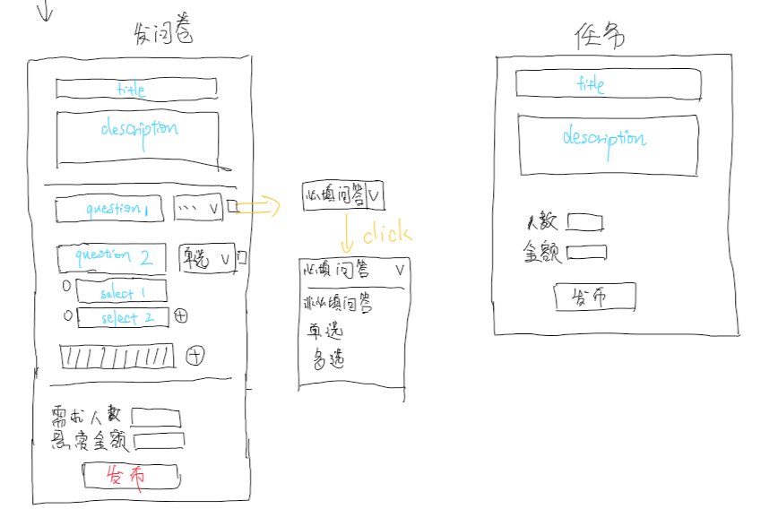
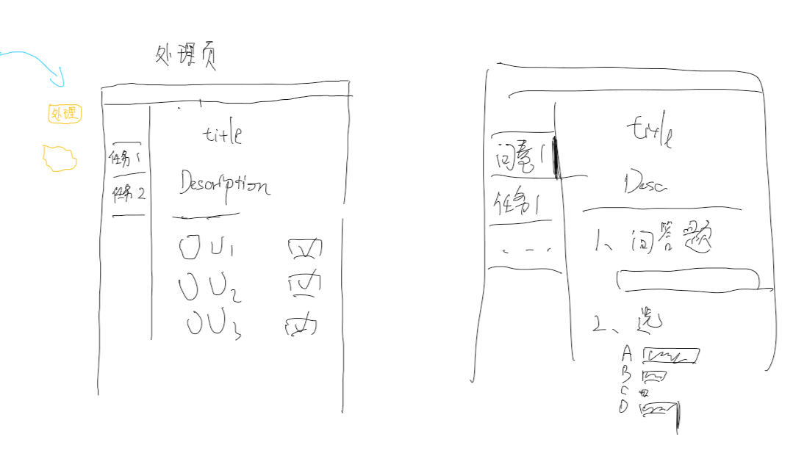

# Meeting2
{:.no_toc}

* 目录
{:toc}

## 1、会议概要

- **目标：** 讨论整个项目运行时的详细过程和所有细节

- **时间：** 2019.06.05

- 线下会议

## 2、会议内容

- 各个页面的基本设计以及功能内容：
  - 登录与注册：
    
  
  - 主页面
    

  - 任务与问卷页
    

  - 任务处理与问卷结果显示页
    

- 页面的基本请求：
  **登录页**
    1. 登录发起一次请求，发送phone&pass，返回User信息

  **注册页**
    1. 注册发起请求，发送填入的所有信息，后端检查某些信息是否重复，返回【成功】【失败】；成功则页面跳转登录页，失败则根据返回信息提示

  **主页**
    1. 每次进入主页，发起一次请求，发送当前User，获得所有task
    2. 筛选
    3. 翻页
    4. 点击某个task的参与时，若为个人号（可以参与）则发起一次请求，后端根据task的剩余参与人数，返回参与是否成功

  **发布页**
    1. 发布问卷or任务时，发起请求，将task存到后端数据库中

- 前端与后端人员同步开发，业务调研人员进行简单的用例建模以方便项目开发。
