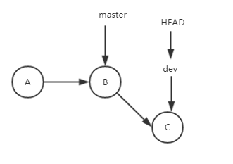
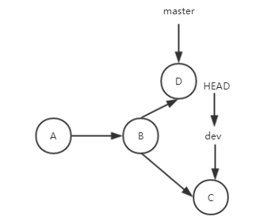
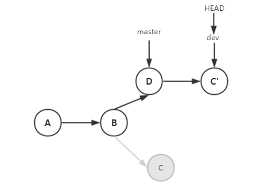

# Git合并分支的方法

## 分支

​	当我们进行团队协作时, 我们往往是在不同的分支中进行的. 这样做的好处是, 在我们编写我们的代码时, 我们不用担心别人的修改会对我们产生影响, 也不用将精力浪费在频繁的整合中. 但是, 我们最终的成果是需要合并到同一个分支上的. 因为责权是很难准确地分配到每个人或某个文件, 某个模块上的, 所以这不可避免的会产生合并冲突. 那么如何合并分支及解决冲突呢. Git给我们提供了两种主要的方法——`merge`, `rebase`

### 合并分支

现在我们有一个分支是`master`,  我们创建一个新的分支`dev`,  现在的`master`和`dev`都指向同一个提交, 然后在`dev`上进行了几次提交. 现在分支图变成了这样:



如果这时候我们需要将`dev`合并到`master`上, 我们只需切换回`master`分支:

```
$ git checkout master
```

然后合并:

```
$ git merge dev
```

大功告成, 因为`master`上没有新的提交, 所以git只是简单地将`master`的`HEAD`指针往前移动到`dev`的最新提交上.

那么如果在合并之前`master`上发生了更改呢, 比如下方的分支图:



这就涉及到合并冲突的问题了, 如果`master`上的更改和`dev`上的更改没有冲突, 那么和之前一样, git会触发`Fast-forward`, 只会简单地将两个分支合并起来, 并往前移动`HEAD`指针

**合并冲突**

而如果存在冲突, 那么当你`merge`的时候, git会提示你要解决冲突, 当你解决完冲突, 并提交之后, 本次合并就完成了. 这样做虽然能让我们达成目标, 但是我们需要额外进行一个提交来解决冲突, 而且往往这个提交除了解决冲突外, 没有其他意义, 尤其是发生在同步远程仓库时, 这相当于是污染了我们的提交历史.

这时候就可以用到`rebase`来解决这个问题啦.

**使用rebase**

当你不想污染提交历史, 又或者你还不想合并分支, 但是又想将`master`上的更改应用到`dev`上时, `rebase`能很方便地达成我们的目标.

还是上面的例子, 在`dev`上使用`rebase`:

```
$ git rebase master
```

之后git会提示你存在冲突, 当你解决冲突并保存修改后, 你可以进入下一步:

```
# "git add/rm <conflicted_files>"
$ git rebase --continue
```

继续完成后续提交的rebase. 这样当你完成rebase后, `dev`分支就获得了`master`的所有修改, 并且没有添加新的`commit`记录就解决完冲突了. 这时候的分支图是这样的:



你没有看错, 之前的提交都改变了. `rebase`实际上是找到两个分支的最近共同节点, 然后重做这个节点之后需要`rebase`的分支上的每一个的提交. 所以这些提交即使内容相同, 但是它们是属于不同的`commit`(这里是C'), 而且之前的`commit`(这里是C)也会消失. 这听起来没什么问题, 但这很可能会带来很大的恶果.

如果这是在团队协作中, 在你`rebase`之前其他人`clone`了你的分支, 并进行了修改. 而你将`rebase`的分支`merge`到了`master`上, 那么其他人将很难合并他的更改, 因为他还保留了你`rebase`之前的`commit`记录, 而这些`commit`记录现在已经不存在了. 当然他可以使用`rebase`或`merge`的方式提交他的代码, 但是这就造成了重复提交(相同的`commit`内容不同的`commit`记录的问题, 这将让`commit`历史非常混乱. 所以建议只在本地仓库使用`rebase`解决合并冲突的问题.

实际上`rebase`不会合并分支, 如果`rebase`后你想合并分支 你只需切换会`master`, 然后`merge`即可:

```
$ get checkout master
$ get merge dev
```

这是Git会触发`Fast-forward`, 完成分支合并.

### 总结

​	在团队协作中, 创建和合并分支是必须的也是值得做的. 对如合并分支, `merge`和`rebase`各有好处. 不论使用什么方法, 都是为了维持一个清晰明了的提交历史. 另外善用`pull request`等功能也能有效地明确提交的来源与去向以及所作提交的意义.