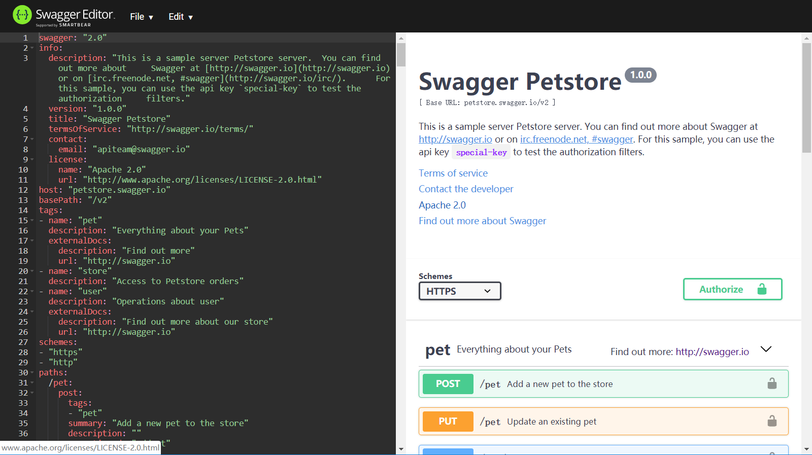

# Swagger编写API文档
{:.no_toc}

* 目录
{:toc}

## 1、简要

### Swagger

  Swagger是一个简单但功能强大的API表达工具，可以产生交互式文档，也有自动生成代码的SDK以及API的发现特性。如今Swagger2.0已经发布，比1.0变得更加强大。

  

### OpenAPI规范

  V2.0版本的OpenAPI规范，帮助开发者描述一个API的基本信息，如一般性描述、路径、操作等；更简单更快速地表达API。

## 2、使用

  - 一般推荐使用YAML而非JSON格式进行编写，因为其更简单

  - 可以用[在线编辑器](http://editor.swagger.io/)编写

  - 也可以在[本地部署](https://github.com/swagger-api/swagger-codegen)

## 2、编写

### 2.1 版本号
  
  通过一个swagger属性来声明OpenAPI规范版本：
  ```yaml
  swagger: "2.0"
  ```

### 2.2 文档信息

  声明此API文档的相关信息
  ```yaml
  info:
    description: ""
    version: "0.1.0"
    title: "Your API Document Title"
    termsOfService: ""
    contact:
      email: "youremail@developer.com"
    license:
      name: "Apache 2.0"
      url: "http://www.apache.org/licenses/LICENSE-2.0.html"
  ```

### 2.3 URL

  声明API的url，以及其使用的协议
  ```yaml
  schemes:
    - https
    - http
  host: simple.api
  basePath: /v1
  ```

### 2.4 路径

  添加路径，以paths标签，在其下添加'/xxx'这样的形式来添加路由路径，比如以下添加了一个/user，结合上一点，则该路径为: "simple.api/v1/user".

  参数要用 {} 括起来：

  ```yaml
  paths:
    /user:
    /user/{id}:
    /user/{id}/page:
    /task:
  ```

### 2.5 标签

  在`paths`的前面，添加一个`tags`，声明本文档会使用的路径分类：
  ```yaml
  tags:
    - name: "user"
      description: "tag of user"
    - name: "task"
      description: "tag of task"
  ```

### 2.6 方法

  在每个路径下，添加任意HTTP动词`GET` `POST` `PUT` `PATCH` `DELETE`等，以添加一个HTTP访问方法

### 2.

