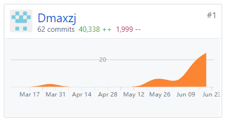

# 个人总结

{:.no_toc}

- 目录
  
  {:toc}

## 信息

- 姓名：邓子杰
- 学号：16340056

## 个人工作报告

我在本次开发项目中负责了项目管理、后端开发、文档编写的工作。
我完成的工作有：

- 前端项目架构设计

- 部分UI设计

- 前端设计及开发

  - 登陆, 注册, 用户详情组件

  - 任务发布组件
  - 创建, 填写, 查看, 统计问卷组件

- 用户相关api接入

- 前后端联调

## 主要工作清单

> 记录最得意/或有价值/或有苦劳的工作清单

- React学习
  

​	我在这个项目中第一次接触了React这个前端库. 不谈框架语法上的东西, React对于hook的设计就让我眼前一亮, 它将组件的状态, 生命周期通过函数调用的方式抽离了出来, 能让我们更加专注于页面和业务逻辑的实现, 而且通过自定义hook的我们能进一步将相关的逻辑抽象出来, 更好的组织代码和实现逻辑的复用. 

  

## PSP 2.1 表格

|                                         | Time (%) |
| :-------------------------------------- | :------: |
| **Planning**                            |    10    |
| - estimate                              |    10    |
| **Development**                         |    80    |
| - analysis                              |    15    |
| - design spec                           |    15    |
| - coding standard                      |    5     |
| - design                                |    20    |
| - coding                                |    20    |
| - code review                           |    0    |
| - test                                  |    5    |
| **Report**                              |    10   |
| - test report                           |    5    |
| - size measurement                      |    1    |
| - postmortem & process improvement plan |    4    |

## 项目贡献度

截止至 2019.06.27

- FrontEnd 仓库

  

## 个人博客清单

- [Git合并分支的方法](../../x3-techniques/16340056/README.md)

## 致谢

感谢我的舍友 @Dennis273 ~~玩耍~~探讨, 解决各种难题.
