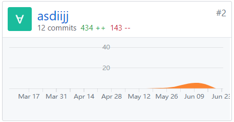
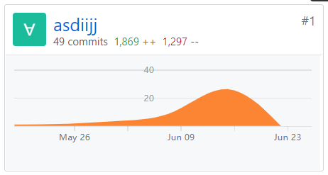

# 个人总结

{:.no_toc}

- 目录
  {:toc}

## 信息

- 姓名：谭发豪
- 学号：16340202

## 个人工作报告

我在本次开发项目中负责了项目管理、后端开发、文档编写的工作。
我完成的工作有：

- 后端API文档
- 后端User建模
- 部分User Controller
- 数据建模
- 团队项目进度的管理
- 项目文档的建立
- 设计说明书

## 主要工作清单

> 记录最得意/或有价值/或有苦劳的工作清单

- 文档建立
  作为团队的项目经理，我建立整个项目文档的框架，并且根据自己对本项目的理解，逐步完善文档的具体细节。从整个WEB端的各个页面要求，到需求、数据模型、前后端接口设计等，我确定了项目的基本样子，在脑海中有个比较清晰而详细的轮廓，并将其写到文档中。

- API文档
  学习并利用Swagger书写后端API文档，其渲染出来的文档效果十分理想，方便了前后端同步开发。

## PSP 2.1 表格

|                                         | Time (%) |
| :-------------------------------------- | :------: |
| **Planning**                            |    10    |
| - estimate                              |    10    |
| **Development**                         |    80    |
| - analysis                              |    15    |
| - design spec                           |    25    |
| - coding standard                      |    5     |
| - design                                |    20    |
| - coding                                |    10    |
| - code review                           |    0    |
| - test                                  |    5    |
| **Report**                              |    10   |
| - test report                           |    5    |
| - size measurement                      |    1    |
| - postmortem & process improvement plan |    4    |

## 项目贡献度

截止至 2019.06.27

- BackEnd 仓库

  

- Dashboard 仓库

  

## 个人博客清单

- [Swagger编写API文档](../../x3-techniques/16340202/README.md)

## 致谢

十分感谢我的组员们，虽然遇到很多困难，但大家还是一起完成了这个项目。
