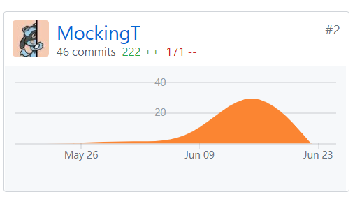

# 个人总结
{:.no_toc}

* 目录
{:toc}

## 1、信息

  - 学号：16340203
  - 姓名：谭江华

## 2、个人简短总结

- 本次项目我主要负责需求规格文档，用例图和各种模型建模。内容包括06-Requirement specification（需求规格说明书）中的全部内容以及07-Design（设计说明书）中的7.5 Usecase desgin（用例设计），此外还参与了项目博客页的构建。

## 3、PSP2.1统计

- |                                                 | Time (%) |
  | :---------------------------------------------- | :------: |
  | **Planning**                                    |    10    |
  | - estimate（预估时间）                          |    10    |
  | **Development**                                 |    85    |
  | - analysis（需求分析，包括学习新技术）          |    10    |
  | - design spec（生成设计文档）                   |    25    |
  | - desgin review（设计复审）                     |    5     |
  | - document writing（文档编写）                  |    25    |
  | - document structure（文档框架）                |    10    |
  | - upload（上传）                                |    5     |
  | - test（测试）                                  |    5     |
  | **Report**                                      |    5     |
  | - personal report（个人报告）                   |    2     |
  | - size measurement（计算工作量）                |    2     |
  | - postmortem & process improvement plan（总结） |    1     |

## 4、主要工作清单

**记录最得意/或有价值/或有苦劳的工作清单**

- 需求规格文档：

  本项目的需求包括了用户登陆注册（个人号，组织号），发布任务，接收任务，确认任务等交互过程，在写需求规格文档的时候，我需要将这些过程和涉及到的参与者都弄清楚，这样才能得到一个清晰的需求规格，便于代码开发也便于用户更清晰地了解和使用我们的系统。

- 模型建模：

  本项目涉及的建模有**用例建模**，**业务流程描述**，**领域建模**，**状态建模**，**功能建模**，**补充需求**，还有**BCE用例设计**。我使用umlet这个软件进行建模，它能完美地提供建模所需的各个部件，操作也比较简单。整个建模工作完成下来，让我对需求规格文档认识更加清晰，并对其进行了补充，使其更可视化，了解需求更加方便。

## 5、贡献图表截图

- 

## 6、个人博客清单

- [项目建模心得及总结](<https://mockingt.github.io/SWSAD_personal/>)

## 7、致谢

- 致谢我的舍友@Asdiijj（16340202），一起探讨项目流程以及完成最终的项目博客。

