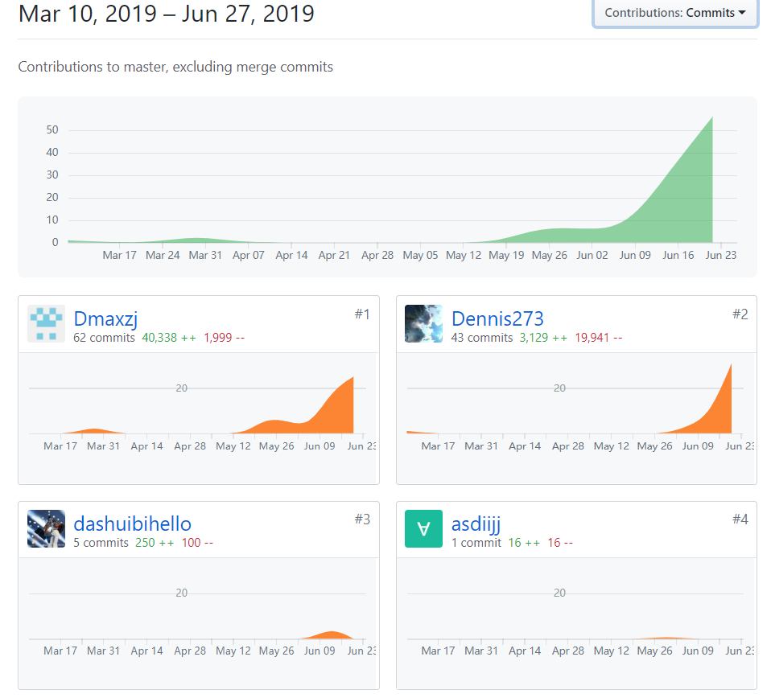
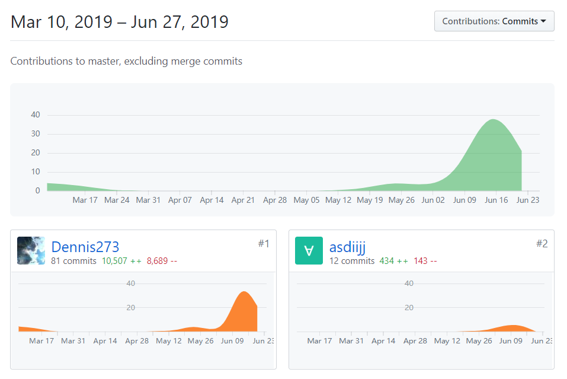
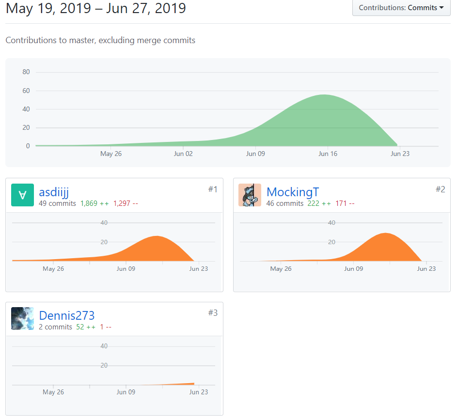

# 小组总结
{:.no_toc}

* 目录
{:toc}

## 1、PSP2.1汇总表

|  | 谭发豪 | 陈祐洋 | 谭江华 | 王睿泽 | 邓子杰 | 邓茅坤 |
| :- | :-: | :-: | :-: | :-: | :-: | :-: |
| **Planning** | 10 | 10 | 10 | 10 | 10 | 10 |
| - estimate | 10 | 10 | 10 | 10 | 10 | 10 |
| **Development** | 80 | 85 | 85 | 85 | 80 | 80 |
| - analysis | 15 | 10 | 10 | 15 | 15 | 20 |
| - design spec | 25 | 5 | 25 | 5 | 15 | 10 |
| - coding standard | 5 | 5 | 5 | 5 | 5 | 5 |
| - design | 20 | 5 | 25 | 15 | 20 | 15 |
| - coding | 10 | 30 | 10 | 20 | 20 | 10 |
| - code review | 0 | 20 | 5 | 15 | 0 | 10 |
| - test | 5 | 10 | 5 | 10 | 5 | 10 |
| **Report** | 10 | 5 | 5 | 5 | 10 | 10 |
| - test report | 5 | 2 | 2 | 1 | 5 | 2 |
| - size measurement | 1 | 2 | 2 | 2 | 1 | 3 |
| - postmortem & process improvement plan | 4 | 1 | 1 | 2 | 4 | 5 |

## 2、贡献图表

  - 前端 FrontEnd

    

  - 后端 BackEnd

    

  - 文档 Dashboard

    

## 3、综合贡献度分配

### 1. 分工与贡献率

  - 基于Git统计报告

  | 学号 | 姓名 | 分工 | 贡献率 |
  |:-:|:-:|:-:|:-:|
  | 16340202 | 谭发豪 | 项目管理、后端、文档 | 20% |
  | 16340046 | 陈祐洋 | 前端、后端、部署 | 42% |
  | 16340221 | 王睿泽 | 前端 | 5% |
  | 16340203 | 谭江华 | 建模与文档 | 10% |
  | 16340056 | 邓子杰 | 前端、UI | 17% |
  | 16340257 | 熊思佳 | 竞品分析 | 3% |
  | 16340055 | 邓茅坤 | 前端 | 3% |

### 2. 制品与贡献率

  |  | 谭发豪 | 陈祐洋 | 王睿泽 | 谭江华 | 邓子杰 | 熊思佳 | 邓茅坤 |
  |:-:|:-:|:-:|:-:|:-:|:-:|:-:|:-:|
  | 前端代码 |  | 20% | 10% |  | 70% |  |  |
  | 后端代码 | 30% | 70% |  |  |  |  |  |
  | UI设计 |  |  | 20% |  | 50% |  | 30% |
  | 前期调研 | 50% |  |  |  |  | 50% |  |
  | 需求文档 | 30% |  |  | 70% |  |  |  |
  | 架构设计 | 80% | 20% |  |  |  |  |  |
  | 项目测试 | 20% | 20% |  | 40% | 20% |  |  |
